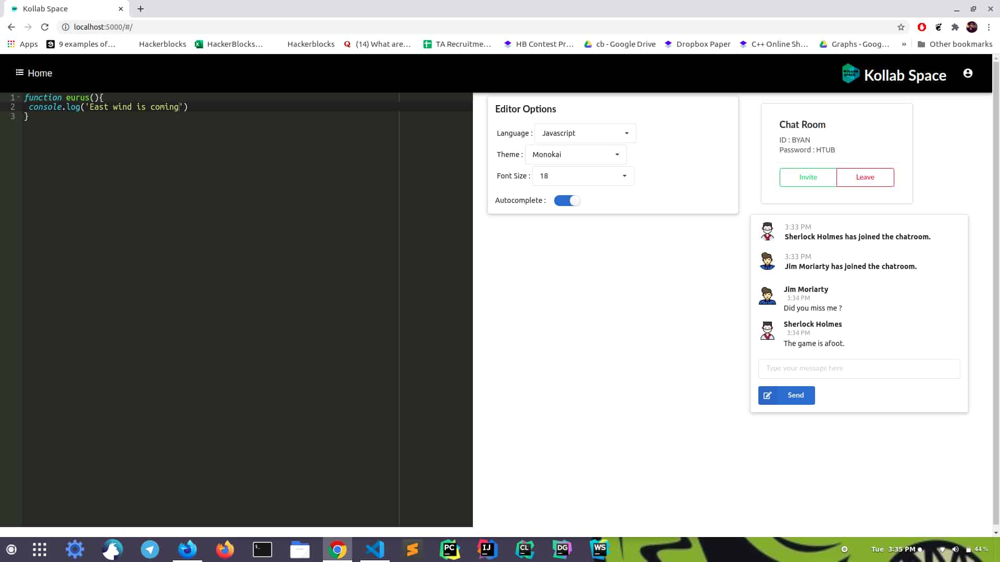

# Kollab Space

[](https://opensource.org/licenses/MIT)   


A collaborative work environment for teams and friends to work together with increased productivity in sophisticated environment.

The project has been deployed on render.com and can be viewed [here](https://kollab-space.onrender.com/).

### About the project

Users can signup, login, join chat rooms and live chat with their friends.<br>
Users can also edit code in the code editor which allows multiple language support with autocompletion feature and all changes are reflected to all other users in the chat room synchronously.

### Tools and Technologies used

<ul>
<li>React
<li>Typescript
<li>ExpressJS
<li>Socket.io
<li>Sequelize with PostgreSQL
<li>Semantic UI CSS
<li>JSON Web Tokens
</ul>

### Demo Video

[](http://www.youtube.com/watch?v=dYy2w2OEJ4Q "Kollab Space - Demo Video")

### Screenshots




### Setting up the project

1. **Clone this repository**

```
git clone https://github.com/tarunluthra123/Kollab-Space.git
```

2. **Install dependencies**

Open the folder and install all the dependencies

```
yarn install
```

3. **Setting up the database**

Run the following commands in your postgres shell.

```
create database kollab;
CREATE USER kollabadmin WITH ENCRYPTED PASSWORD 'kollabpass';
GRANT ALL PRIVILEGES ON DATABASE kollab TO kollabadmin;
```

You may opt other database name, username and password. However if you do so, make a .env file and store that information in the .env file.

The .env file is not required if you opt for default settings.

Alternatively, if you choose other database credentials but do not intend to create a .env file, you can make the changes in /backend/db/connection.js .

4. <b>Running the project locally</b>
   <br>

Once set up open the project directory and open two terminals.<br>
In the first terminal, run the backend server.

```
yarn server
```

This should run your backend server on localhost:7483. To choose any other port, change the port number in backend/server.js.

In the second terminal, run the frontend development server.

```
yarn react
```

This will run your frontend on localhost:3000.

Your project is up and running. Enjoy !!
